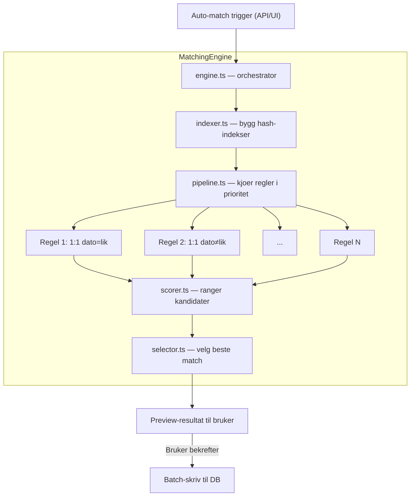

# Matching Engine — Arkitektur og implementeringsplan

## Navaerende tilstand

- **Manuell matching fungerer** — bruker velger poster, sum valideres, match lagres.
- **Database-skjema er klart** — `matching_rules`-tabell med prioritet, regeltyper, dato/belop-toleranse, betingelser (JSONB). `matches`-tabell har `rule_id` og `match_type` ("auto"/"manual").
- **Ingen automatisk matching eksisterer** — `matching_rules` er aldri brukt, `rule_id` er alltid null.
- Domenespesifikasjonen definerer 10 standard regler i prioritetsrekkefølge (se [DOMAIN_SPEC_NEW.md](docs/DOMAIN_SPEC_NEW.md) linje 183-196).

---

## Arkitektur



### Filstruktur

```
src/lib/matching/
├── engine.ts               # MatchingEngine — orkestrerer hele flyten
├── pipeline.ts             # Kjoerer regler i prioritetsrekkefølge
├── indexer.ts              # Bygger hash-indekser paa amount, date, reference
├── scorer.ts               # Beregner match-konfidenspoeng
├── selector.ts             # Velger optimale, ikke-overlappende matcher
├── rules/
│   ├── one-to-one.ts       # 1:1 matching (hash join paa negert beløp)
│   ├── many-to-one.ts      # Many:1 matching (subset-sum)
│   ├── many-to-many.ts     # Many:Many matching (partisjon-basert)
│   └── internal.ts         # Intern matching (innen samme mengde)
├── matchers/
│   ├── amount.ts           # Beloepssammenligning (eksakt, toleranse, negering)
│   ├── date.ts             # Datosammenligning (eksakt, toleransevindu)
│   └── fields.ts           # Feltfiltre fra conditions JSONB
└── types.ts                # MatchCandidate, MatchResult, PipelineContext, etc.
```

---

## Fase 1 — Kjernemotor med 1:1 matching

### 1a. Typer og grensesnitt (`types.ts`)

Kjernetyper som brukes gjennom hele motoren:

```typescript
interface IndexedTransaction {
  id: string;
  setNumber: 1 | 2;
  amount: number;          // fast presisjon (heltall i oere)
  date: number;            // epoch-dag for rask sammenligning
  reference: string | null;
  description: string | null;
  dimensions: Record<string, string | null>;
}

interface MatchCandidate {
  set1Ids: string[];
  set2Ids: string[];
  ruleId: string;
  score: number;           // 0-100 konfidenspoeng
  difference: number;      // beloepsdifferanse
}

interface PipelineContext {
  clientId: string;
  unmatchedSet1: Map<string, IndexedTransaction>;
  unmatchedSet2: Map<string, IndexedTransaction>;
  results: MatchCandidate[];
}

interface MatchingResult {
  candidates: MatchCandidate[];
  stats: { totalMatched: number; byRule: Record<string, number> };
  duration: number;
}
```

### 1b. Indeksering (`indexer.ts`)

Noekkel til ytelse ved 100k+ poster. Bygger hash-maps **en gang**, gjenbrukes av alle regler.

- **Amount-indeks**: `Map<number, Set<string>>` — grupperer transaksjoner etter beloep (i oere for eksakt integer-sammenligning). For 1:1 matching: slaa opp negert beloep i O(1).
- **Date-indeks**: `Map<number, Set<string>>` — grupperer etter dato (epoch-dag).
- **Compound-indeks**: `Map<string, Set<string>>` — noekkel = `${amount}|${date}` for raskeste 1:1 med dato.
- Alle indekser bygges **per mengde** (Set 1 og Set 2 separat).

### 1c. 1:1 regel (`rules/one-to-one.ts`)

**Algoritme** (hash join — O(n)):
1. For hver umatched transaksjon i Set 1:
   - Beregn nøkkel: negert beloep (og dato hvis `dateMustMatch`)
   - Slaa opp i Set 2-indeks
   - Hvis treff: lag `MatchCandidate`, scorer basert paa feltsamsvar
2. Scorer rangerer kandidater (dato-naerhet, referanse-match, beskrivelse-likhet)
3. Selector velger best match per transaksjon (greedy med score-prioritering)

**Dato-toleranse**: Naar `dateToleranceDays > 0`, utvid soeket til et vindu `[date - N, date + N]`.

**Beloeps-toleranse**: Naar `allowTolerance`, godta kandidater med differanse innenfor `toleranceAmount`. Differanse lagres i `matches.difference`.

### 1d. Pipeline (`pipeline.ts`)

```typescript
async function runPipeline(
  rules: MatchingRule[],      // sortert etter prioritet
  set1: IndexedTransaction[],
  set2: IndexedTransaction[]
): Promise<MatchingResult> {
  const ctx: PipelineContext = {
    unmatchedSet1: new Map(set1.map(t => [t.id, t])),
    unmatchedSet2: new Map(set2.map(t => [t.id, t])),
    results: [],
  };

  for (const rule of rules) {
    if (!rule.isActive) continue;
    const handler = getHandler(rule.ruleType, rule.isInternal);
    const candidates = handler.findMatches(rule, ctx);
    // Fjern matchede fra unmatched-pools
    for (const c of candidates) commitCandidate(ctx, c);
  }

  return { candidates: ctx.results, stats: computeStats(ctx), duration };
}
```

### 1e. Engine (`engine.ts`)

Orkestrerer hele flyten: hent data, indekser, kjoer pipeline, returner resultat.

```typescript
class MatchingEngine {
  async preview(clientId: string): Promise<MatchingResult>
  async commit(clientId: string, candidates: MatchCandidate[]): Promise<void>
}
```

- `preview()` — kjoerer pipeline uten aa skrive til DB. Returnerer kandidater for brukerens godkjenning.
- `commit()` — batch-insert matches + batch-update transaksjoner i en enkelt DB-transaksjon.

---

## Fase 2 — Many:1 og Many:Many

### 2a. Many:1 (`rules/many-to-one.ts`)

**Problem**: Finn en delmengde av transaksjoner i Set 1 som summerer til en transaksjon i Set 2 (eller omvendt).

**Algoritme** (hybrid subset-sum):
1. For hver transaksjon T i Set 2 (ankertransaksjonen):
   - Finn alle transaksjoner i Set 1 med samme fortegn (negert) som T
   - Filtrer paa dato (hvis `dateMustMatch`) — reduserer soekerommet drastisk
   - Kjoer **begrenset subset-sum** med maks N elementer (default 8, konfigurerbart)
   - For smaa kandidatmengder (leq 20): meet-in-the-middle (O(2^{n/2}))
   - For større: greedy med sortering etter beloep + backtracking
2. Scorer basert paa antall poster, datonaerhet, feltmatch

### 2b. Many:Many (`rules/many-to-many.ts`)

**Problem**: Finn to delmengder (en fra Set 1, en fra Set 2) som summerer til 0.

**Algoritme** (iterativ partisjonering):
1. Bygg kandidatklynger: grupper transaksjoner med lignende referanse/beskrivelse/dato
2. Innen hver klynge: kjoer subset-sum for aa finne balanseringsgrupper
3. Begrensning: maks M transaksjoner per side (default 6), maks K kandidater per klynge

### 2c. Intern matching (`rules/internal.ts`)

Gjenbruker 1:1 og Many:1 algoritmer, men opererer innen **en enkelt mengde** (Set 1 mot Set 1 eller Set 2 mot Set 2). Negert-beloep-logikken gjelder fortsatt.

---

## Fase 3 — API-endepunkter

Nye ruter under [src/app/api/clients/[clientId]/](src/app/api/clients/[clientId]/):

- **`POST /auto-match`** — starter matching-pipeline, returnerer `MatchingResult` (preview)
- **`POST /auto-match/confirm`** — tar inn `candidates[]`, committer til DB
- **CRUD `/matching-rules`** — GET (list), POST (create), PATCH (update), DELETE

Eksisterende `POST /matches` (manuell) og `DELETE /matches` (unmatch) beholdes uendret.

---

## Fase 4 — Frontend: Auto-match-knapp og preview

### 4a. Auto-match-knapp i matching-toolbar

- Ny primaer-knapp "Automatisk matching" i [matching-view-client.tsx](src/components/matching/matching-view-client.tsx)
- Klikk trigger `POST /auto-match` — viser spinner/progress
- Naar